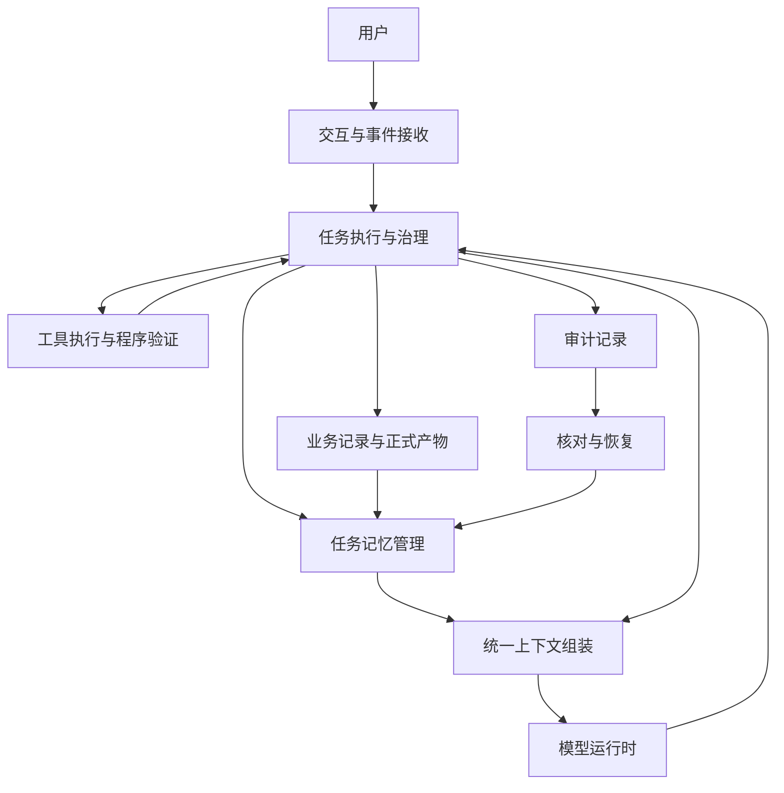

# v2.3 结构化任务记忆——架构设计 AI 草案

## 文档状态

- 日期：2026-09-16。
- 状态：用户明确委托撰写，待评审、待确认、未实施。
- 依据：已讨论的 v2.3 五步方案及对应 Dev Design AI 草案。
- 本文说明组件职责和协作方式，具体数据与接口由 Dev Design 定义。
- 当前有效架构仍为 `docs/ARCHITECTURE.md`；本草案不自动替代它。

## 1．架构目标

让每次模型请求都能获得一致的任务记忆，准确理解当前目标、已确认事项、自己的问题、用户回答和相关产物。切换模型、重新请求或恢复执行时，这些关系仍然可用。

沿用本地单用户、严格单 Worker 和现有治理阶段。记忆提供判断依据，任务推进仍由程序校验和用户审批共同控制。

## 2．整体结构

模型运行时继续支持现有模型路由和技术降级。所有角色共享同一个记忆读取入口，各角色再获得完成当前行动所必需的专用材料。

## 3．组件职责

### 交互与事件接收

接收需求、回答、审批和验收反馈，保留用户原文。回答与当前实际提出的问题关联；审批与待审批文档关联。两种交互分开处理，避免把「批准文档」误当作回答。

### 任务执行与治理

负责领取任务、决定当前执行边界、校验模型建议、控制预算和状态转换。它在实际提问、收到回答、完成行动、更新正式文档和产生验证结果时，触发记忆更新。

模型提出下一行动并不表示行动已经完成。执行组件必须先获得真实结果，再记录相应事实。

### 任务记忆管理

把业务记录整理为统一的当前记忆，维护四类内容：

- 工作状态：当前目标、当前问题、最近行动及结果、等待用户决定的事项。
- 确认依据：用户问题与回答、已批准的需求及有效决定。
- 正式产物：当前需求和设计版本，以及明确保存的设计跳过依据。
- 工作证据：当前失败、验证结果、文件变化和写入产物的来源。

记忆维护由程序完成。模型可提供解释和建议，但这些内容必须保留依据，不能自行成为用户已确认的决定。

### 统一上下文组装

为每次逻辑模型请求读取有效记忆，提供完整问答、当前决定、当前文档和必要证据。不同阶段的专用输入，例如设计差异、当前代码和失败报告，继续由阶段执行组件提供。

同一次请求发生传输重试或模型技术降级时，使用同一份上下文。实际行动完成后，下一次请求读取更新后的记忆。

本版先保证内容一致和来源准确。精细的上下文选择、摘要压缩和 Token 展示留给后续版本。

### 模型运行时

负责模型请求、响应合并和工具调用协议。它使用组装后的上下文，不自行维护第二套任务记忆。

作者、评审、规划和返修角色可以有不同指令与专用材料，但对当前有效需求、确认依据和任务目标的认识应来自同一个入口。

### 工具执行与程序验证

负责真实文件操作、命令执行、启动、测试和浏览器验证。结果返回执行组件，并成为可核对的工作证据。

写入产物关联本次请求实际使用的问答、文档和事件。该关联说明输入来源；文件是否正确落实需求，仍通过覆盖检查、测试和人工验收判断。

### 审计与恢复

保存完整请求、合并响应、工具结果和业务变化。流式片段仅用于实时展示，不参与永久记忆或恢复。

恢复组件依据已提交业务记录核对记忆，补齐中断期间未反映的变化。历史审计只在恢复或明确调查时读取，不在每次调用中整体回放。

## 4．主要协作流程

### 提问、回答与跨模型执行

1. 执行组件判断需要澄清，登记模型实际提出的问题并暂停任务。
2. 用户回答与该问题一起保留，短回答也不脱离原问题。
3. 语义门径判断回答是否充分；部分回答继续澄清。
4. 后续模型请求通过统一入口获得确认依据及未解决事项。
5. 更换模型时使用同样的有效记忆，继续当前目标。

回答已收到、含义已澄清、文档已批准、软件已验收是不同事实，不能互相代替。

### 决定变化与下游修订

用户提出新要求后，系统保留旧决定与新反馈。明确的替代关系随需求候选进入评审和审批，批准后更新有效决定及正式版本。

旧记录保留为历史；当前上下文明确标记其失效状态。冲突方向不明确时继续询问，模型不能自行取消用户决定。

需求更新后，现有 Planner 继续判断哪些设计需要修订、哪些可以复用，再推动代码与验证更新。

### 执行、证据与完成

执行组件记录每次实际行动结果，关联对应产物和验证依据。代码变化后，旧成功验证不再代表当前版本通过；再次验证后才更新当前结果。

任务记忆帮助模型理解进展，不替代完成门径。自动验证通过后仍等待用户验收。

## 5．记录的权威边界

运行状态和用户消息以业务数据库为准；文档内容以相应正式产物为准；验证结果以真实执行记录及其对应代码版本为准。

任务记忆是这些来源的结构化视图。它便于模型使用，但不能反向修改源记录，也不能因为模型在记忆中看到了「完成」就直接放行。

正式需求的用户批准、架构与设计的程序正式化、Planner 的设计跳过决定必须明确区分，避免把系统产物误称为用户授权。

## 6．恢复与兼容原则

业务提交与记忆更新存在中断窗口，因此记忆更新须能够重复核对而不重复创建关系。业务已提交但记忆尚未更新时，恢复组件补齐变化；未提交内容不能成为确认依据。

无法核对来源、发现跨任务引用或关键记录缺失时，停止依赖该记忆的自动执行并保存原因，不猜测用户决定或重新执行未知结果的工具动作。

旧任务逐个兼容，不批量改历史。不可靠的旧问答与产物关联保留为调查线索；只有充分来源才能成为确认依据。旧版记忆推断不得静默升级为新设计中的可信关系。

## 7．验收依据

机制验证应证明问答不串配、审批不混入回答、产物来源可追溯、版本替代正确，以及恢复后记录不会重复。

真实模型验证应覆盖短指代回答、模型切换、重新请求和 Worker 恢复。核对实际发送上下文和模型行为，确认已明确回答的问题没有被重复询问，同时真正未回答的问题仍会澄清。

生成软件仍需实际启动、运行测试和浏览器操作，最终由用户验收。不能只凭记忆文件存在或模型表示「记得」认定 v2.3 完成。

## 8．待确认的架构取舍

- 采用统一记忆管理和统一上下文入口，复用现有业务及审计来源。
- 保留原始确认依据，模型解释不获得独立的确认权限。
- 当前记忆可依据已提交记录恢复，来源无法核对时停止自动执行。
- 本版保持现有阶段专用材料，后续再优化上下文体积。

本文件交付的是待确认架构草案。对应实施契约见 `docs/DEV_DESIGN_V2_3_AI_DRAFT.md`。
