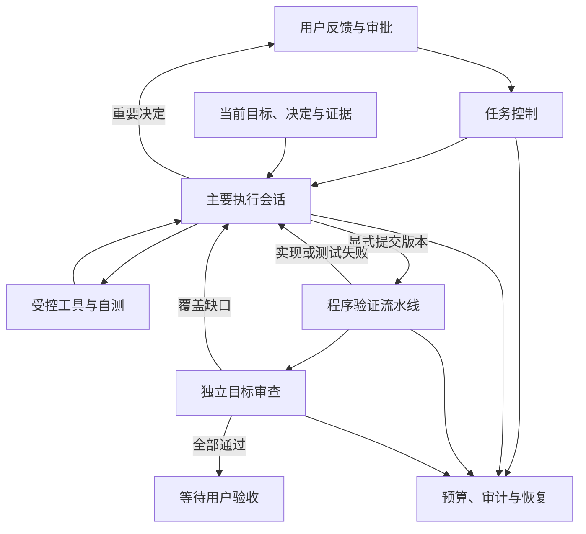

# 已有网站返修——架构 AI 草案 v1

2026-10-09 实施状态覆盖：Docker Sandbox 前置验证已通过，第一批固定收尾及第二批连续会话／任务范围权限已实现和机制验证；真实工具合成集成通过，真实模型新模式返修未验证。后文待决措辞保留原设计历史，当前依据见 [有效 Dev Design](DEV_DESIGN.md) 与 [第二批证据](evidence/repair-session-validation-20261009.md) 。

## 文档状态

- 日期：2026-10-05。状态：用户明确确认；第一批已实施并机制验证，后续待实施，真实新模式未验证。执行隔离技术仍待决定。
- 产品依据：[返修产品草案](REPAIR_PRODUCT_V1_AI_DRAFT.md) 。实现契约见 [Dev Design 草案](REPAIR_DEV_DESIGN_V1_AI_DRAFT.md) 。
- 本方案为已确认返修增量，按批次更新有效规范后实施；现有运行架构仍为 `ARCHITECTURE.md`。本方案先用于明确授权的新返修尝试，旧任务不自动切换。

## 1．目标与技术选择

一个主要执行 Agent 在连续任务上下文中调查、计划、修改、自测和修复；程序承担权限、预算、状态推进及固定验证；用户确认重要产品决定和最终验收。第一目标完整交付，第二目标降低成本。

建议延续 React、FastAPI、MySQL、单 Worker 及现有工作区和 Trace。返修主会话使用 DeepSeek thinking，Luna 保持暂不用。独立目标审查单独只读调用，不另设日常 Planner。首版建议不增加数据库表，新增运行数据使用版本化工作区文件；既有 v2.3 记忆草案仅吸收合适概念，不自动采纳未确认规则。

## 2．协作结构

## 3．职责边界

| 组件 | 职责 | 现有基础 |
|---|---|---|
| 任务控制 | 消费事件、初始化授权尝试、处理等待和恢复、投影数据库状态 | worker.py、api.py |
| 主要执行会话 | 持续调查和执行，修订局部计划，自测后明确提交 | model_tool_loop、model.py |
| 上下文管理 | 当前目标与授权、有效决定、最新失败、文件信息及必需协议历史 | repair_objectives、tool_summaries、context_relay |
| 工具与权限 | 限定访问、搜索定位、修改、自测和提交 | tools.py、UnitTools／SliceTools 中可复用能力 |
| 验证与交付 | 当前版本全量测试、服务、浏览器及目标核验，确定性进入待验收 | worker 中现有测试／启动／验证、repair_objectives.verify |
| 审计与恢复 | 记录请求与结果、预算、阶段检查点、版本证据及不确定副作用 | StepRun、Trace、持久工作区 |

上述是逻辑职责，不拆成多个服务或多个开发 Agent。先按升级直接需要的边界提取代码，不为了整理模块全面重写 Worker。

## 4．会话与阶段

Task 表示任务，执行会话表示连续工作的模型上下文，StepRun 表示阶段审计。阶段切换不重新定义模型职责，也不自动丢失调查正文。开发提交、程序测试、启动和验证仍记录既有 Step；固定推进不调用模型选择下一步。

验证失败后回到同一逻辑执行会话，追加当前失败与版本证据。因上下文容量在合法完整工具批次边界建立后续消息上下文时，完整历史仍在审计中；该重建不改变任务目标、Provider、授权和累计预算。Provider 变更需要显式边界，不直接混用供应商专有思考协议。

## 5．授权与修改范围

局部实现范围由任务授权确定，不从「最后拥有 verify_product.py 的卡」推导。计划说明修改目标和相关文件，但不作为永久文件所有权。允许修改已授权隔离产品中的业务实现及测试；正式需求、验收标准、目标账本、预算及审计由程序保护。

测试可以修复错误或补充覆盖，但原始业务要求和独立回归依据不能因当前实现失败而削弱。程序检查与独立审查共同判断，不能声称能确定性识别所有语义弱化。

**待决：执行隔离。**当前 `_exec` 在宿主机以子进程执行代码并继承 Worker 环境。固定命令和文件工具路径限制不能阻止生成测试或脚本访问其他文件、环境或网络。建议先实现固定验证收尾；扩大写权限与新单会话的真实执行，须在受控运行环境的选型、允许数据及最小凭据传递获确认并验证后启用。现有 API／工具保护不宣称已经构成操作系统沙箱。

## 6．提交与验证

执行 Agent 必须主动自测并显式提交，程序不因自测绿灯或文字结束自动接管。提交绑定产品、测试、脚本和有效需求版本，验证期间禁止同任务并发编辑。全量测试 → 服务检查 → 真实浏览器 → 独立目标核验按固定顺序执行。

产品失败返回执行会话；系统环境故障记录为环境问题，不默认让模型改业务软件。全部证据对当前版本有效、必需目标核销且 URL 可访问后，程序进入 waiting_acceptance，无需模型调用 finish。用户明确通过后才能 succeeded。

## 7．预算和恢复

预算在 Provider 实际发送边界执行，涵盖重试、降级和审查。执行阶段只能使用扣除审查预留后的额度；额度比例由每轮授权确定。预算耗尽记录独立原因，保留成果，不技术降级、清零或自动续跑。

持久记录先于可能产生费用或副作用的动作；单 Worker 恢复时核对当前版本、已完成工具结果、进程及阶段结果。可确认已完成动作不重复执行；无法确认的响应或命令结果明确阻塞。文件与数据库不能整体原子提交，需按持久记录幂等修复投影，详见 Dev Design。

## 8．兼容与实施边界

- 建议通过每次返修尝试的执行方式标记启用，不根据新版本 Worker 自动迁移。
- 先完成程序收尾及预算停止分类，再实现连续会话和任务范围权限，随后统一读取和上下文。
- 旧单元／切片入口、已有产品及历史预算保留；旧 Task 1 不自动进入新模式。
- 当前前端阶段可继续展示；增加返修状态、停止原因和实际用量，不把 failed 软件可访问误写为已交付。
- 数据库 schema、新依赖、运行隔离选型及旧任务采用新方式均需相应授权。

## 9．方案取舍与验证

继续修补角色交接能保持旧行为，但不能直接消除上下文分散和中间规划调用；单会话减少交接，同时承担目标漂移及上下文增长风险，因此保留原目标、结构化当前状态和独立验收。扩大产品访问能避免错卡，但执行隔离风险必须先解决。

验收要求：无提前提交、无过期证据复用、范围变更有依据、固定验证阶段无规划调用、原目标不被最新错误覆盖、真实请求总上限有效、恢复不重置预算或重复可确认副作用。真实成功率与 Token 收益通过同起点有界实验记录，不由机制测试数量推断。
