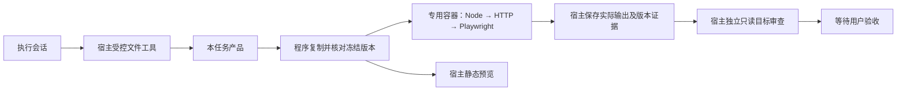

# 已有网站返修：Docker 执行隔离设计 v1

## 2026-10-09 当前实现与运行状态

2026-10-09，Sandbox v1 真实隔离探针与合成集成通过，全套 376 项通过。profile 绑定当前源码、镜像、Docker 环境和原始证据，检查通过后新 repair-v1 入口可用；环境或证据变化则关闭。正式空闲 API／Worker 已加载，原任务、schema、产品和旧调用计数保持。真实模型返修未验证；第二批连续会话／任务范围写权限状态见当前实施记录。详见 [真实验证记录](evidence/sandbox-isolation-real-20261009.md) 。

## 0．状态与决定

日期：2026-10-05。用户已明确确认本设计并授权实施。当前开始实现，运行隔离未验证；真实 repair_request 门禁在对应探针通过前保持关闭。本文保留 AI 起草来源，具体镜像及兼容结果在实施记录中补充。

依据：[已确认返修架构](REPAIR_ARCHITECTURE_V1_AI_DRAFT.md) 、[已确认返修 Dev Design](REPAIR_DEV_DESIGN_V1_AI_DRAFT.md) 。只补执行隔离前置条件，不改变原业务需求或批准真实调用。旧素材平台、正式库、已有容器和累计 220 次预算保持。

核心建议：模型调用及文件修改由宿主程序控制；生成 Node／Python／浏览器脚本仅在本任务专用容器执行。以冻结副本作为执行输入，不挂载正在编辑的产品或完整工作区。隔离跑通后再接连续主会话与任务范围权限。

## 1．职责与数据流

| 部分 | 责任／权限 |
|---|---|
| 宿主 Worker／Provider | 调用模型、凭据认证、授权／预算、受控文件修改、提交、审计及状态投影 |
| ContainerExecutionRuntime | 核对任务／提交／镜像，创建专用容器，执行固定动作，收集退出与资源事实 |
| 任务容器 | 读取当前版本的产品副本，执行 Node、容器内 HTTP 服务和 Playwright，无 Provider 或数据库凭据 |
| 宿主预览服务 | 用可信固定服务程序提供已验证提交的静态文件，只监听本机；不执行生成 Python／Node |

生成进程不能直接写 audit／runtime、调用 Docker 或核销目标。容器输出是不可信数据，只有程序根据已确认门禁决定阶段结果；输出中的「成功」或自报检查数不是交付证明。

## 2．文件与凭据

建议目录（实施前按本约定建立）：

- `workspace/<task_id>/isolation/<attempt_id>/snapshots/<version_id>/product/`：程序复制的冻结产品，版本由内容清单决定。
- `evidence/repair-container-<attempt_id>-<version_id>.json`：程序记录容器 ID、镜像 digest、挂载／用户／网络／限制、命令 intent 和结果引用。
- 原提交、目标、预算、Trace 仍用现有 evidence；不移入容器、不覆盖旧证据。
- 实现位于现有 `backend/app/runtime/`；镜像构建文件已按确认约定创建于 `runtime-images/website-repair/`，不存产品或凭据。

复制时只纳入批准产品清单，拒绝符号链接、特殊文件、越界路径及凭据文件；不遍历复制父目录、其他任务、真实用户资料、secrets、.env、.git 或治理文件。快照拷贝前后核对原字节版本；源变化使自测／提交失效，不接受混合副本。

容器仅只读挂载这份 product 到 `/product`，根文件系统只读；允许的写入为有容量上限的容器临时区域 `/tmp` 和私有共享内存。HOME／浏览器配置／临时夹具指向临时区域。测试不得修改产品源目录，需要写夹具时使用临时目录；现有测试不兼容时保存具体错误，不自动放宽挂载。

**容器不挂载任何宿主可写目录。**日志通过 Docker 控制接口取回，由宿主写入 evidence，不让生成进程把文件／链接投放到审计目录。环境采用固定白名单 PATH、HOME、语言／临时目录及浏览器路径；不复制 Worker 的 os.environ、代理或认证。Docker 控制能力仅属于宿主，不挂 Docker socket、设备、宿主 PID／IPC 或宿主网络。

这是拟定边界，必须以探针验证；只读 bind mount 是 Docker 提供的机制，不能由这一设置单独推出系统完全安全。[Docker 挂载说明](https://docs.docker.com/engine/storage/bind-mounts/) 。

## 3．网络与预览

容器采用 `--network none`，不发布端口、不接正式 MySQL 或现有项目网络。Node 临时服务、Worker 受控静态服务和 Playwright 同在一个容器，访问容器自己的 `127.0.0.1`。Docker 文档说明该驱动只创建回环设备；是否满足本机全部阻断要求仍需探针。[Docker 网络说明](https://docs.docker.com/engine/network/drivers/none/) 。

验证脚本仍读取 argv 的 URL，由程序传入容器内部地址；服务由程序启动，脚本不得自行替代托管服务。Node 测试可按既有规则创建容器内临时 URL 夹具。任何外部服务需求都超出当前原生本地网站范围，不自动开网。

**预览与容器验证地址分开保存。**容器内 URL 不返回给用户。宿主固定静态服务读取同一冻结快照，为用户提供本机 URL；不采用宿主网络或端口映射去打通断网容器。健康检查验证入口内容与提交一致，浏览器验证结果绑定内部 URL／容器，预览绑定外部 URL／提交，不能拿旧 URL 的健康结果冒充新版本。

同任务沿用可确认的预览地址和 origin，避免 localStorage 因端口变化失效；更新当前提交由程序切换只读快照引用，先检查是否影响正在进行的用户操作。容器验证使用独立临时浏览器数据，不读取用户预览存储。用户浏览器中执行网页 JavaScript不受 Docker 网络约束，本方案不声称隔离用户的正常浏览器；自动验收使用受控容器浏览器。

## 4．镜像及运行参数

镜像预置 Node、Python、固定版本 Playwright 包及配套 Chromium、系统库；依赖安装只发生在受控镜像构建阶段，不在模型工具或任务运行时安装。镜像使用可复核 tag＋digest，不用 latest；具体版本与当前主机架构在构建前核对，不在本轮编造 digest。

Playwright 官方镜像包含浏览器／系统依赖，Python 包仍需安装且版本匹配；官方指出 root 会禁用 Chromium sandbox，对不可信内容建议使用独立用户和所需 seccomp 设置。[Playwright Docker 说明](https://playwright.dev/python/docs/docker) 。本方案建议非 root、只读根、禁止新增权限、关闭特权模式，使用经过验证的最小能力和浏览器必要 seccomp 权限。不用 unconfined、SYS_ADMIN、host IPC 或 no-sandbox 作为启动兜底；这些约束下浏览器能否运行是实施验证项，失败则门禁保持关闭。

新模式建议统一 bundled Chromium 的启动契约，不能假定 macOS 本机 Chrome 在 Linux 镜像中存在。已有脚本若硬编码 channel="chrome"、本机路径或平台专有工具，先标运行契约不兼容；经已确认范围修改后形成新版本，不做隐藏替换或跳过。该浏览器选择属于本草案待确认项。

建议初始每容器 2 CPU、2 GiB 内存、256 PID、512 MiB 私有 shm、256 MiB tmpfs；Node 120 秒、浏览器 300 秒、健康检查 10 秒。数值是待验证起点，不是已测容量或通用默认。宿主控制超时涵盖 Docker 调用与子进程，超时停止本容器全部子进程，并核对 OOM／退出事实；环境限制失败不默认要求模型修改业务。

资源与进程限制属于 Docker 的运行配置，必须核对 inspect 实际值后再执行。[Docker 运行说明](https://docs.docker.com/engine/containers/run/) 。Docker 不承诺抵御全部内核逃逸；首版为本地单用户生成代码增加可验证执行边界，不宣称适用于任意恶意租户。

## 5．执行及恢复接口

建议 ContainerExecutionRuntime 提供固定 `prepare_snapshot`、`ensure_container`、`run_unit_tests`、`start_internal_service`、`run_browser_validation`、`inspect_execution`、`stop_execution`；方法由程序调用，不作为模型任意 shell 工具。Docker CLI 使用参数列表，不拼接模型提供的命令；Node 测试清单和 Python 验证入口来自固定产品契约。

执行结果沿用 ToolResult，并追加 container_id、image_digest、task_id、attempt_id、submission_id／version_id、command_id、时间、实际退出码、timed_out、oom_killed、输出截断及完整证据引用。容器 exit 0 不单独构成测试通过，保留零测试／skip／todo、真实浏览器、原目标及版本门禁。

每次自测执行当前产品的冻结副本，自测绑定副本及源版本；源在执行后变化即失效。显式提交复用版本相同的快照。容器按任务＋尝试＋版本隔离，同一冻结版本验证与内部服务可共用一个容器；版本改变准备新容器，不能把运行中旧文件当新提交。

动作前持久化唯一 command_id、intent、期望镜像和版本，启动时保存完整 Docker ID 与控制标签。恢复先 inspect：身份／参数／镜像／快照不符则 stopped；实际结果可确认则复用，未知命令结果或找不到匹配容器记 unknown_side_effect，不直接重放。单 Worker，不新增数据库表或分布式锁。

业务断言失败返回执行会话；缺镜像／浏览器、Docker 异常、OOM、无法确认副作用等记录环境停止。预算仍在宿主 Provider 守卫，准备容器／重启不增加模型额度。日志即使由产品伪造也不能更改预算和程序账本。

停止范围仅限完整 ID、标签、快照均匹配的本尝试容器。停止不自动删除快照、容器或证据；不使用自动 rm／prune。删除按项目红线另行授权，避免破坏恢复依据或其他项目。

## 6．验证与启用门禁

先用无真实密钥的合成产品；一次预先限定探针范围，不调用真实模型。容器构建／运行验证通过之前，不解除当前 repair_execution_isolation_pending。

| 必需验证 | 期望 |
|---|---|
| 读取父目录、其他任务、治理及合成凭据标记 | 标记不在容器中；宿主文件指纹保持 |
| 读取环境及 Docker socket | 只有白名单环境，无认证／socket |
| 写产品、审计、快照及越界路径 | 只读／不可见；宿主快照与账本不变 |
| 链接和特殊文件输入 | 拷贝前拒绝，不执行 |
| 外网、宿主服务、数据库／其他容器网络 | 连接失败；内部回环服务可用 |
| 正常 Node＋Chromium＋内部 HTTP | 真执行，无 skip，副作用仅在临时区域 |
| 零测试／假成功／输出截断 | 原完成门禁继续生效，完整输出有界留存 |
| 超时、子进程、OOM | 宿主边界有效，实际原因可核对，不留无限进程 |
| 中断恢复／旧容器身份或版本 | 核对后复用或明确停止，不重复未知动作 |
| 预览刷新及同 origin 重启持久化 | 验证／预览同提交，保留业务持久化要求 |
| 旧任务／正式 DB／现有容器 | 不迁移、不停止、不修改 |

不仅检查启动参数：要执行合成逃逸探针并核对容器实际配置和宿主哨兵。探针失败记录实际原因，不改成特权／开网来获得绿灯。

分步实施建议：确认本草案 → 镜像和 Runner／快照 → 合成隔离探针 → 接入自测及固定验证／预览 → 实现连续主会话及任务权限 → 另行批准有界真实缺陷测试。最后比较从反馈到待验收的完整成本，而非只比较单次请求。

## 7．本次调研的依据与限制

已打开 Docker 运行、bind mount、none 网络及 Playwright Python Docker 官方文档，核对只读挂载、默认网络、回环、镜像／非 root 浏览器约束。上述是机制依据，不能当作本机镜像兼容、浏览器 sandbox、资源参数或隔离成功的证据。

本轮仅文档设计，没有启动／改动 Docker，没有安装依赖或变更系统配置、服务、正式数据、旧任务、预算；未实现 Runner、未做容器探针、未授权真实模型调用。
